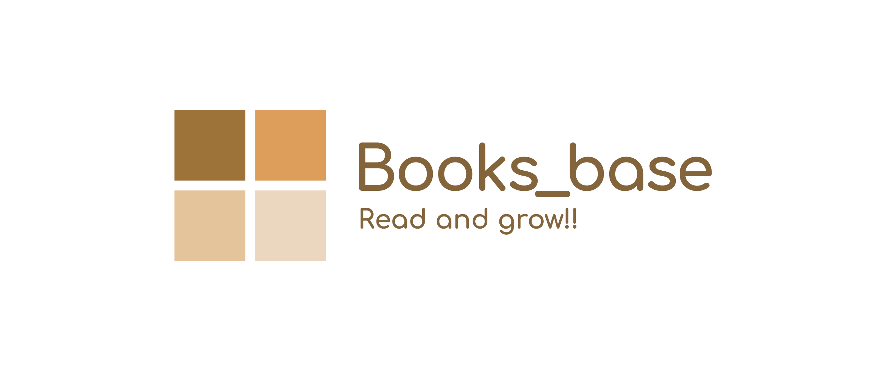
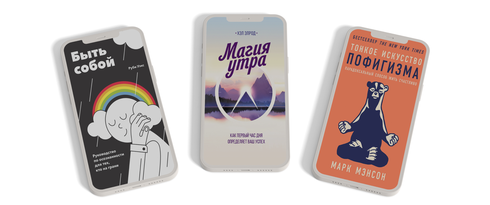
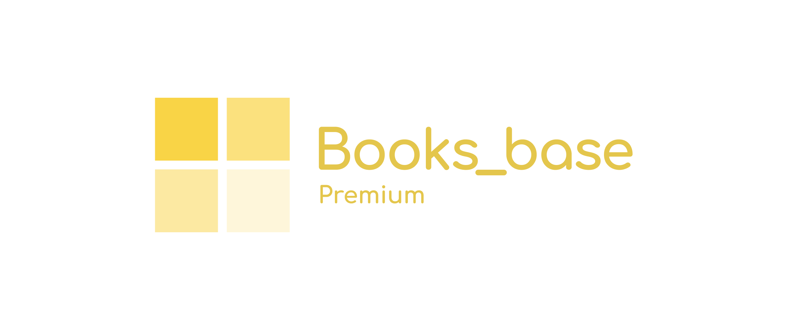
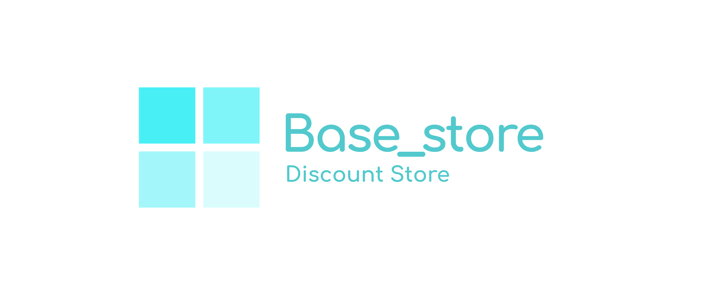
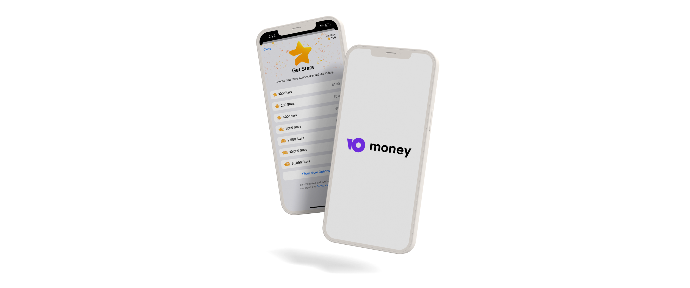

# 📖 Welcome to the Books_base Library!!

## 🟤 What is Books_base??

**Books_base** is a unique e-book store where every book is priced at **85₽**. We simplify the purchasing process, making it transparent and accessible to all users.

Our catalog is constantly growing thanks to the active participation of our readers, who can order new books and influence the expansion of the selection.

## 🟤 How does it work??

All interactions with **Books_base** are handled through our **[Telegram bot](https://t.me/Books_base_bot)**. We offer a wide range of features, including:

- 🔍 **[Search](#-Search)**: Quick and convenient book searches by author, genre, title, and article number.
- 🗃️ **[My Books](#%EF%B8%8F-my-books)**: All purchased books are saved in your profile for quick access.
- 📝 **[Book Orders](#-Book-Orders)**: If a book is not in the library, you can order it, and we will try to add it to the catalog within 24 hours.
- 📚 **[Promotions](#-Library-Promotions)**: Daily deals with special book offers.
- ⚜️ **[Premium Status](#%EF%B8%8F-Premium-Status)**: Unlimited access to the entire library.
- 💎 **[Base_store](#-Base_store)**: Internal currency, base, which can be exchanged for discounts or free books.
- 💳 **[Payment Methods](#-Payment-Methods)**: Payments through **YooMoney** or **Telegram stars**.
- 💬 **[Technical Support](#-Technical-Support)**: Prompt resolution of any questions.
- 🟠 **[And much more...](#-Privacy-Policy)**

> All the bot's features are described in the article **[Books_base bot commands](https://telegra.ph/Books-base-Bot-Commands-EN-10-14)**.

## 🔍 Search

The **Books_base** search system allows you to find the books you need in seconds with high accuracy:

- **By title**: Enter the book title, and the bot will show the relevant results.

- **By author**: Enter the author's name to get a list of    all their books.

- **By genre**: Choose or enter a genre to see all the books in that category.

- **By article number**: If you know the book's article number, enter it, and the bot will instantly send you the book. _(You can find the article number at the bottom of each book post in our **[Telegram channel](https://t.me/Books_base)**)._

For easy navigation through the search results, pagination buttons (⬅️/➡️) are provided to help you move between pages.

The entire system is interactive — you can click on book titles, authors, genres, or article numbers for instant access or to copy information.

## 🗃️ My Books

The `/my_books` command gives you instant access to all the books you've purchased. This is your personal library where you can download and read the books you've bought at any time.

Navigation is simplified with pagination buttons (⬅️/➡️), and the **«Read»** button sends you all available formats of the selected book.

> [!NOTE]\
> Users with **Premium** status don’t need this command, as they have full access to the entire library.

## 📝 Book Orders

If you can't find the book you're looking for in the library, use the `/order` command to request it. We aim to add new books to the catalog within 24 hours, ensuring that your requests are fulfilled as quickly as possible.

> [!NOTE]\
> We reserve the right to refuse service for your order without providing reasons. We categorically do not add textbooks, study guides, workbooks, or books promoting Russian propaganda.

## 📚 Library Promotions

**Books_base** offers unique promotions to help users buy books at more affordable prices:

- **Daily Promotion**: Every day, one new book is available for **50₽** for 24 hours.

> [!NOTE]\
> Books added by user request remain priced at **85₽**.

- **Saturday Promotion**: Every Saturday, you can choose **three books for 150₽** by using the `/saturday` command.

> For more detailed information about promotions, read the article **[Library Promotions](https://telegra.ph/Books-base-Promotions-EN-10-16)**.

## ⚜️ Premium Status

For **385₽**, you can purchase **Premium** Status, which grants unlimited access to the entire **Books_base** library. This gives you access to **over a thousand books** with no additional costs.

This is a **one-time** purchase, making reading affordable and beneficial for active users.

## 💎 Base_store

For every purchase you make at **Books_base**, you earn internal currency called **_base_**, which can be used in the **Base_store** to get discounts or free books:

- **15%** discount — **20 _base_**
- **30%** discount — **35 _base_**
- **50%** discount — **45 _base_**
- **Free book — 50 _base_**

You can also share **_base_** with friends using the `/share_base` command, helping them get discounts or free books.

## 💳 Payment Methods

You can pay for books at **Books_base** using two methods:

- **YooMoney**: Pay with a bank card through the **YooMoney** payment system, with no fees.
- **Telegram stars**: Pay using Telegram’s internal currency — **_[stars](https://telegram.org/blog/telegram-stars?ln=r)_**. After completing the transaction, the bot will automatically send you the book files.

> For more detailed information about payment methods, read the article **[Payment and Return Policy](https://telegra.ph/Books-base-Payment-and-Refund-Policy-EN-10-15)**.

## 💬 Technical Support

If you have any questions or issues, use the `/support` command to contact our support team. You can attach up to 10 photos or videos in one message to visually demonstrate the problem.

We’re always ready to help and provide the most accurate solution.

## 🔒 Privacy Policy

We collect minimal data to operate the service — your Telegram ID, username, and order information. All data is securely protected and is not shared with third parties.

> For more details, read the article **[Books_base Privacy Policy](https://telegra.ph/Books-base-Privacy-Policy-EN-10-14)**.

## 🔴 Refund Policy

We check every book before adding it to the library to ensure it contains the full content. If you find an incomplete version of a book, contact support, and we’ll replace the product or offer a refund in **_stars_** or three free books.

> Full details of the refund policy can be found in the article **[Payment and Return Policy](https://telegra.ph/Books-base-Payment-and-Refund-Policy-EN-10-15)**.

## 📰 News Channels

To stay updated on all the latest promotions, book releases, and updates from **Books_base**, subscribe to our Telegram channels:

- **[Books_base | Электронные книги](https://t.me/Books_base)**  – the official and primary channel of the store.
- **[Books_base | Новости](https://t.me/Books_base_news_ru)** – our Russian language news channel.
- **[Books_base | News](https://t.me/Books_base_news_en)** – our English language news channel.
- **[Books_base | Новини](https://t.me/Books_base_news_uk)** – our Ukrainian language news channel.

---

**Books_base** strives to make the book-buying process quick and convenient for every user. We appreciate your support and love seeing our library grow thanks to your orders. Discover new books and enjoy reading with **Books_base**!!

---

> **Read and grow!!**